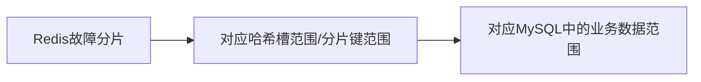

2025-12-08 17:22
Status: #idea
Tags: [[系统设计]]

# 1 库存管理核心需求和技术实现
## 1.1 背景
库存系统需要支持水平扩展，并且支持高并发，因此我把它大致分为下面几层：
- 接入层：用Nginx负载均衡、请求路由
- 业务层：Go 服务，库存核心逻辑。无状态服务，这样支持水平扩展
- 缓存层：Redis缓存热点库存数据，降低 DB 压力
- 存储层：MySQL持久化库存数据，保障写的强一致性
- 消息层：处理非核心流程（如库存日志、预警通知），削峰填谷提升并发能力

库存管理简单实现。最核心的设计在于库存增减
- 分析系统的维度：写读操作占比，写读一致性的保障粒度
- 库存管理写读操作qps差距不大，既不像秒杀系统大部分都是写请求，也不像商品系统大部分都是读请求
- 要保障写操作的高并发，就需要牺牲一点读操作的一致性，让读操作保证最终一致就行
- 为了支持高并发，就不能纯用数据库操作，得引入缓存
- 因为写读操作qps差距不大，所以就不能使用只读缓存，会引起缓存失效风暴
    
## 1.2 分布式锁方案
假设我要保障缓存和数据库的一致性，就需要使用分布式锁。分布式锁我使用开源框架Redisson。

### 1.2.1 读流程
流程：
1. 先读缓存，命中则返回库存
2. 没有命中则加分布式锁（商品粒度），并设置锁的超时时间
3. 读数据库
4. 把数据库的值写入缓存
5. 返回库存
6. 上面操作完成后(无论成功或失败)释放锁（例如用 go 的 defer）

针对读流程的每一步，每一步失败分别的处理：
1. 读缓存重试多次后仍失败(如超时)，则在限流的保护下读取数据库的库存返回
2. 加分布式锁重试多次后仍失败(如超时)，则在限流的保护下读取数据库的库存返回。
    - 此时Redis可能挂了，因此不回写缓存
    - 如果读数据库也失败了，增加数据库读的熔断（如 Sentinel/Resilience4j），熔断后返回 “暂时无法查询库存” 的降级提示；
3. 重试多次后仍失败(如超时)，则返回错误
4. 失败后再重试一次，还失败无数据影响，但后续要对数据库做限流保护

### 1.2.2 写流程
流程：
1. 加分布式锁（商品粒度），并设置锁的超时时间
2. 先更新数据库（注意，sql已经保障了库存写的强一致）
3. 再更新缓存
4. 上面操作完成后(无论成功或失败)释放锁（例如用 go 的 defer）

针对写流程的每一步，每一步失败分别的处理：
1. 加分布式锁重试多次后仍失败(如超时)，在限流（商品粒度）的保护下更新数据库库存(强一致更新)，最后返回
    - 如果更新数据库也失败了，增加数据库写的熔断（如 Sentinel/Resilience4j），熔断后返回 “暂时无法变更库存” 的降级提示；
    - 这个方法可能会导致Redis恢复之后和数据库库存不一致，不过只要库存的超时时间设置较短，那么不一致的窗口比较小。相当于用读的一致性换可用性
2. 更新数据库重试多次后仍失败(如超时)，则进行熔断
3. 更新缓存重试一次后仍失败(如超时)，返回操作成功，但后续要对数据库做限流保护
    - 这也是用读的一致性换可用性
4. 释放锁重试一次后仍失败(如超时)，打点告警

### 1.2.3 总结
核心要点：
1. 通过缓存减少了数据库在读方面的压力
2. 更新数据库时也同时更新缓存，避免缓存失效风暴
3. 使用分布式锁保障同一商品的并发写请求串行执行，减轻了它们之间的不一致（还有缓存短超时 + 轻量重试操作）
	- 无法让 “更库 + 更缓存” 成为原子操作（原子操作要求 “要么全成功、要么全失败”）
4. 每次写操作，都需要更新数据库，因此数据库在写方面的操作数没有减少。
	- 但是通过「商品粒度分布式锁串行化写请求」，避免了纯数据库方案中 “行锁激烈竞争导致的锁等待、连接池满、超时失败” 等问题，提升了数据库写请求的 “有效 QPS”（即成功处理的写请求数 / 秒）

### 1.2.4 和纯数据库方案的对比
#### 1.2.4.1 前提限定（确保对比公平性）
- 硬件 / 环境：单机 MySQL（8 核 16G，机械硬盘）、Redis 集群（3 主 3 从，8 核 16G）；
- 场景：单商品并发、读写 QPS 1:1、库存更新 SQL 带行锁（`UPDATE stock SET num = num - ? WHERE id = ? AND num >= ?`）、分布式锁为商品粒度（Redisson 锁，超时 1s）；
- 指标：“有效 QPS”（成功处理的请求数 / 秒，排除超时 / 失败请求）。

#### 1.2.4.2 大致 QPS 对比

| 方案     | 读 QPS（有效）   | 写 QPS（有效）  | 核心差异说明                                                                                                                       |
| ------ | ----------- | ---------- | ---------------------------------------------------------------------------------------------------------------------------- |
| 纯数据库方案 | 约 500-800   | 约 200-300  | 1. 读：所有读请求打数据库，行锁 / IO 瓶颈导致读 QPS 低；<br><br>2. 写：行锁竞争激烈，大量请求锁等待超时，有效写 QPS 低                                                   |
| 分布式锁方案 | 约 5000-8000 | 约 800-1200 | 1. 读：90%+ 读请求走缓存，仅缓存缺失 / 失效时打数据库，**读 QPS 提升 10 倍以上**；<br><br>2. 写：分布式锁串行化写请求，减少数据库行锁竞争，**有效写 QPS 提升 3-4 倍**（写库次数未减，但成功率大幅提升） |

## 1.3 分库分表优化
分库分表参见 [[MySQL-分库分表]]

### 1.3.1 前提限定
- 分库规则：按商品 ID 哈希分片（如`crc32(商品ID) % 3`），**商品请求完全均匀，无热点库 / 热点商品**；
- 硬件 / 环境：3 个独立 MySQL 库（每个库配置同此前单机：8 核 16G、机械硬盘），Redis 集群不变，分布式锁仍为**商品粒度**（不跨库）；
- 核心逻辑：分布式锁方案的基础流程（读缓存优先、写先锁后更库更缓存）不变，仅数据库层拆分为 3 个库；
- 指标：仍以 “有效 QPS”（成功处理的请求数 / 秒）为核心，排除超时 / 失败请求。

### 1.3.2 分库分表对读写 QPS 的提升原理
#### 1.3.2.1 写 QPS：接近线性提升（核心收益）
分布式锁方案下，写请求的瓶颈已从 “数据库行锁竞争” 转为 “单库的 CPU/IO/ 连接数”，分库后：
- 每个库仅处理 1/3 的商品写请求，单库写压力直接降至原来的 1/3；
- 商品粒度分布式锁不跨库（哈希到哪个库的商品，锁仍绑定商品 ID），不会引入跨库锁复杂度；
- 单库的写请求竞争进一步降低（原本单库处理所有商品写，现在仅 1/3），写请求的处理效率（成功率、响应速度）进一步提升。

#### 1.3.2.2 读 QPS：小幅提升（非核心收益）
分布式锁方案下，90%+ 的读请求走 Redis 缓存，分库对读 QPS 的提升仅体现在 “缓存穿透 / 失效时的数据库读请求”：
- 原本缓存缺失的读请求全部打单机库，现在分散到 3 个库，单库的读穿透压力降至 1/3；
- 核心读 QPS 仍由 Redis 支撑，因此读 QPS 提升幅度远低于写 QPS。

### 1.3.3 库分表 vs 单库（分布式锁方案）QPS 对比
| 维度        | 分布式锁 + 单库 | 分布式锁 + 3 库分表 | 提升幅度                | 核心原因                                                |
| --------- | --------- | ------------ | ------------------- | --------------------------------------------------- |
| 读 QPS（有效） | 5000-8000 | 8000-12000   | 约 50%-100%          | 缓存穿透请求分散到 3 个库，单库读压力降低，Redis 层读 QPS 无瓶颈，仅极限读 QPS 提升 |
| 写 QPS（有效） | 800-1200  | 2400-3600    | 约 200%-300%（接近 3 倍） | 每个库处理 1/3 写请求，单库写压力降至 1/3，且无跨库竞争，写效率线性提升            |

#### 1.3.3.1 关键补充（仅限定该场景）
1. 写 QPS 接近 3 倍提升的前提是 “商品请求完全均匀”：
    - 若存在热点商品（如某商品占 10% 写请求），该商品的写请求仍哈希到单个库，该库的写 QPS 瓶颈会低于其他库，整体写 QPS 提升会低于 3 倍；
2. 读 QPS 提升有限的核心是 “缓存兜底”：
    - 分布式锁方案下读请求的核心载体是 Redis，分库仅优化 “缓存失效的边缘场景”，无法改变 Redis 的读 QPS 上限；
3. 无额外复杂度损耗：
    - 按商品 ID 哈希分库，分布式锁仍绑定商品 ID（不跨库），无需引入分布式事务 / 跨库锁，因此 QPS 提升无 “复杂度抵消性能” 的问题。

## 1.4 Redis库存增减方案
### 1.4.1 背景
Redis架构：Redis Cluster+主从库

~~Redis没法保障数据的一致性；而它和MySQL的原子性也不能保障（网络故障、中间件故障、业务程序中断问题），也就保障不了MySQL的最终一致性，不能用MySQL给Redis兜底。~~
~~对于库存管理这样一个强一致系统，不可接受。~~

为了应对Redis宕机导致数据丢失的问题，需要保障MySQL的最终一致，这样才能让它能正确地恢复Redis数据。

### 1.4.2 写流程
#### 1.4.2.1 方案1：本地消息表
两阶段提交：
1. 往消息表中插入一条状态“待确认”的库存更新消息，消息大小尽量小
	- 这一步如果失败，可以重试一到两次。重试仍失败则返回报错 
	- 因为要重试，那么消息插入要保障幂等性。可以把请求ID（全局唯一）存入消息表，并设置为唯一键
	- 如果消息插入唯一键冲突，则根据消息状态返回结果
		- 待确认：请求待处理
		- 待发送、已发送或已消费：请求成功
		- 重试失败：请求失败
2. 然后更新Redis库存
	- 这一步如果失败，可以重试一到两次。因为要重试，那么Redis操作要保障幂等性。可以在Redis中存储一个请求ID的set，用它来判断幂等。库存更新和set插入用lua脚本保障原子性。
	- 重试仍失败，则返回**请求待处理**（注意不是失败）
	- **熔断机制**：可能要等Redis上线，再触发宕处理流程
3. 在异步协程中，把消息改成待发送
	- 成功后把Redis set中的请求ID去掉，然后发送MQ消息；
		- MQ消息发送
			- 成功后把消息改成已发送
			- 否则重试一到两次，仍然失败则结束，等定时任务兜底
	- 否则重试一到两次，仍然失败则结束，等定时任务兜底
4. 返回请求成功

**核心耗时**：仅来自**消息表的单条插入**。即使是普通 MySQL 实例，单表单条插入的 QPS 也能达到几千到上万。消息表是小表，仅存储 request_id、状态、精简业务数据，无大字段和复杂索引，性能更优；再加上分表，QPS 可提升至数万。

##### 1.4.2.1.1 后台定时任务
对待确认、待发送的消息进行处理（注意并发隔离）： 
1. 待确认的消息，重新执行更新Redis操作，因为Redis有幂等set，不会重复执行更新。
	- 更新成功后，把状态更新为待发送
		- 状态更新成功后Redis set中的请求ID去掉
		- 状态更新失败则重试一两次，还是失败则等下一次定时任务兜底
	- 更新失败则重试（指数退避策略），超过最大重试次数，则把消息状态置为请求失败
		- **极端情况**：如果Redis更新成功，但返回响应失败，那么和MySQL就不一致了。大概率不会有，因为不太可能请求重试能发送成功但接受不成功。但是需要对账兜底
2. 待发送的消息，重新执行MQ消息发送，成功后把消息改成已发送。并且查下Redis幂等set中还有没有请求ID，有的话把它删掉

##### 1.4.2.1.2 消息消费者
进行幂等消费，开启事务：
- 执行数据库更新
- 更新成功把消息状态改成已消费

##### 1.4.2.1.3 其他设计
- 消息表可以按月分片，这样能控制单表大小，同时最多读本月、上月两个月的消息。
- 定时对账：等MySQL某个商品消费完之后（业务低峰期），看下它和Redis的库存是否一致。不一致则告警，后续人工是否介入暂停写入，并把MySQL数据刷回Redis。

##### 1.4.2.1.4 最大缺点
假设一天QPS都维持在1w，那么消息表一天就要新增 8.64亿数据。

#### 1.4.2.2 方案2：事务消息
1. 发送事务消息
	- 这一步如果失败，可以重试一到两次。重试仍失败则返回报错 
2. 然后更新Redis库存
	- 这一步如果失败，可以重试一到两次。因为要重试，那么Redis操作要保障幂等性。可以在Redis中存储一个请求ID的set，用它来判断幂等。库存更新和set插入用lua脚本保障原子性。
	- 重试仍失败，则返回**请求待处理**（注意不是失败），等反查兜底
		- 缺点：不是长久的幂等，如果调用方没收到结果而再次重试，那么会导致重复操作。
		- 解决：在MySQL中插入一个请求待处理的任务，等反查执行后根据结果更新状态。然后给调用方一个查询接口，而不要重试写接口。
	- **熔断机制**：可能要等Redis上线，再触发宕处理流程
3. 提交消息
	- 成功后，异步把Redis set中的请求ID去掉
		- 去掉的操作的重试仍失败，则记录在数据库中，等待后续删除
	- 否则重试一到两次，仍然失败则结束，等反查兜底
4. 返回请求成功

反查：根据请求ID，查询Redis的请求ID set。
- 查询成功：
	- 如果有
		- 开启事务
		- 更新任务状态为成功
		- 提交MQ消息
		- 提交事务
		- 删除请求ID
	- 没有则
		- 开启事务
		- 更新任务状态为失败
		- 回滚MQ消息
		- 提交事务
- 查询失败：则等下次反查

### 1.4.3 读流程
流程：
- 读缓存，命中则返回库存，未命中返回商品不存在

### 1.4.4 Redis宕机处理
Redis某个分片主节点崩溃，需要进行数据恢复工作。

#### 1.4.4.1 实现分片数据恢复的关键是「数据边界可追溯」

“分片数据” 的边界，本质是**槽位对应的业务数据边界**。

#### 1.4.4.2 确定故障分片的「数据边界」
1. 通过 Redis Cluster 的命令（如`cluster nodes`）可以直接查看每个节点负责的哈希槽范围。
2. 映射槽位到业务分片键：需要依赖你前期定义的**Redis key 命名规范 + 分片键规则**（推荐使用 Redis 的`Hash Tag`机制）。
	- 示例：业务中库存的 key 命名为`{sku_id}:stock`（`{}`内的`sku_id`是分片键，Redis Cluster 会根据`sku_id`计算哈希槽，而非整个 key，确保同一 sku_id 的所有 key 落在同一槽位）。
	- 工具：开发一个**槽位↔分片键**的映射工具，输入槽位范围（0-5460），就能计算出哪些`sku_id`的 key 会落在这些槽位里（本质是反向计算`CRC16(sku_id) % 16384`是否在 0-5460 范围内）。
		- 可以维护了**槽位范围↔分片键范围**的元数据：比如将 16384 个槽位分成 8 段，每段对应固定的 sku_id 哈希范围，并存入配置中心（如 Nacos、ETCD）。

#### 1.4.4.3 从 MySQL 中筛选该分片对应的业务数据
- 若 MySQL 表是**按分片键分表 / 分区**的（如`sku_stock_0`到`sku_stock_31`，按`sku_id % 32`分表），可以直接定位到对应的分表，查询效率极高；
- 若 MySQL 表是单表，但`sku_id`是主键 / 索引，也能通过`WHERE sku_id IN (xxx, xxx)`或范围查询快速筛选数据。
- 注意：**需先等待消息队列中该分片相关的未消费消息处理完毕**，确保 MySQL 中的数据是最新的。

#### 1.4.4.4 批量加载数据到恢复后的 Redis 分片
- 避免单条写入：使用 Redis 的批量写入工具（如`redis-cli --pipe`、Python 的`redis-py`批量执行`set`命令，或 Redis 的`MSET`命令），将筛选后的 MySQL 数据批量写入故障分片（主从切换后的新主节点）。
- 增量数据处理：恢复期间，可将该分片的写请求暂时缓存，之前的消息表就是不错的选择。

## 1.5 异步写库方案
MQ 缓冲 + 异步更新

## 1.6 替换存储引擎

## 1.7 批量写入
合并写请求，减少 MySQL 写次数。
写操作存在延迟（取决于合并阈值 / 超时时间），不适合对实时性要求极高的场景。

# 2 面试代码设计
## 2.1 问题
面试官：要求用代码写一个库存管理程序，不需要特别详细，给出大致流程和结构即可。要求这个程序能够在多机器上部署，支持水平扩容，支持高并发，需要用到至少3种设计模式。

## 2.2 设计思路与关键要点
### 2.2.1 架构设计
采用**无状态服务 + 分布式存储**架构，核心分层如下：
	
| 分层   | 职责                             | 技术选型（简化）         |
| ---- | ------------------------------ | ---------------- |
| 接入层  | 负载均衡、请求路由，将请求分发到任意库存服务节点       | 网关（如 Nginx）      |
| 业务层  | 库存核心逻辑（无状态），多实例部署支持水平扩容        | Go 服务（多进程 / 多机器） |
| 缓存层  | 缓存热点库存数据，降低 DB 压力，提升高并发下的响应速度  | Redis            |
| 存储层  | 持久化库存数据，分布式部署保证数据可靠性           | MySQL（分库分表）      |
| 异步层  | 处理非核心流程（如库存日志、预警通知），削峰填谷提升并发能力 | Kafka/RabbitMQ   |
| 分布式锁 | 解决高并发下库存扣减的竞态问题（防超卖）           | Redis Redlock    |


### 2.2.2 关键技术要点
- **无状态服务**：业务层不存储任何会话 / 状态数据，所有状态（库存、配置）存储在分布式缓存 / DB，新增服务节点即可扩容；
- **分布式锁**：Redis 实现分布式锁，解决多节点并发扣减库存的超卖问题；
- **缓存优先**：热点库存数据缓存到 Redis，读请求优先查缓存，写请求先更缓存再异步刷 DB；
- **异步解耦**：非核心操作（如日志、预警）通过 MQ 异步处理，提升主流程响应速度；
- **限流熔断**：可选（简化版暂不实现），防止高并发打垮服务；

### 2.2.3 设计模式选型
| 设计模式  | 应用场景                                      |
| ----- | ----------------------------------------- |
| 单例模式  | 全局配置管理器、日志管理器、数据库等中间件，保证全服务唯一实例，避免重复初始化资源 |
| 策略模式  | 库存扣减策略：区分普通商品、秒杀商品的扣减逻辑（秒杀更严格，需预扣减）       |
| 观察者模式 | 库存预警：当库存低于阈值时，通知邮件、短信、系统通知等不同观察者          |

## 2.3 核心工作流程
以**库存扣减**（最核心的高并发场景）为例，完整流程如下：
1. **初始化阶段**：
    - 加载单例配置（数据库、Redis、MQ）；
    - 初始化单例日志管理器；
    - 注册库存预警观察者（邮件、短信通知）；
2. **请求接入**：
    - 客户端扣减库存请求经网关路由到任意库存服务节点；
3. **业务处理**：
    - 根据商品类型（普通 / 秒杀），策略模式选择对应的扣减策略；
    - 获取 Redis 分布式锁，防止多节点并发扣减；
    - 检查缓存中库存是否充足，不足则直接返回失败；
    - 扣减缓存库存，异步刷写 DB；
    - 若扣减后库存低于阈值，触发观察者模式，异步发送预警通知；
    - 释放分布式锁；

## 2.4 Go 代码实现（简化版）
### 2.4.1 目录结构
inventory-manager/
├── config/      # 单例配置
├── logger/      # 单例日志
├── inventory/   # 库存核心逻辑
├── lock/        # 分布式锁
├── cache/       # Redis缓存
└── main.go      # 入口

### 2.4.2 配置管理器
单例模式。也可以用 `wire` 库实现
```go
package config

import "sync"

// 全局配置结构体
type Config struct {
	RedisAddr     string // Redis地址
	DBAddr        string // 数据库地址
	MQAddr        string // MQ地址
	WarningThreshold int  // 库存预警阈值
}

var (
	instance *Config
	once     sync.Once
)

// GetInstance 获取单例配置
func GetInstance() *Config {
	once.Do(func() {
		// 模拟从配置文件加载
		instance = &Config{
			RedisAddr:        "127.0.0.1:6379",
			DBAddr:           "127.0.0.1:3306",
			MQAddr:           "127.0.0.1:9092",
			WarningThreshold: 10, // 库存低于10触发预警
		}
	})
	return instance
}
```

### 2.4.3 日志管理器
单例模式
```go
package logger

import (
	"log"
	"os"
	"sync"
)

type Logger struct {
	*log.Logger
}

var (
	instance *Logger
	once     sync.Once
)

// GetInstance 获取单例日志
func GetInstance() *Logger {
	once.Do(func() {
		file, _ := os.OpenFile("inventory.log", os.O_CREATE|os.O_WRONLY|os.O_APPEND, 0666)
		instance = &Logger{
			Logger: log.New(file, "[INVENTORY] ", log.LstdFlags),
		}
	})
	return instance
}

// Info 简化日志方法
func (l *Logger) Info(msg string) {
	l.Logger.Println("[INFO] " + msg)
}

// Error 简化日志方法
func (l *Logger) Error(msg string) {
	l.Logger.Println("[ERROR] " + msg)
}
```

### 2.4.4 核心：库存逻辑
```go
package inventory

import (
	"context"
	"fmt"
	"time"

	"inventory-manager/cache"
	"inventory-manager/config"
	"inventory-manager/lock"
	"inventory-manager/logger"
)

// -------------------------- 观察者模式：库存预警 --------------------------
// Observer 观察者接口
type Observer interface {
	Notify(sku string, stock int) // 库存预警通知
}

// EmailObserver 邮件观察者
type EmailObserver struct{}

func (e *EmailObserver) Notify(sku string, stock int) {
	logger.GetInstance().Info(fmt.Sprintf("邮件预警：商品%s库存不足，当前库存%d", sku, stock))
	// 实际场景：调用邮件发送API
}

// SmsObserver 短信观察者
type SmsObserver struct{}

func (s *SmsObserver) Notify(sku string, stock int) {
	logger.GetInstance().Info(fmt.Sprintf("短信预警：商品%s库存不足，当前库存%d", sku, stock))
	// 实际场景：调用短信发送API
}

// Subject 被观察者（库存）
type Subject struct {
	observers []Observer // 观察者列表
}

// RegisterObserver 注册观察者
func (s *Subject) RegisterObserver(o Observer) {
	s.observers = append(s.observers, o)
}

// NotifyObservers 通知所有观察者
func (s *Subject) NotifyObservers(sku string, stock int) {
	for _, o := range s.observers {
		o.Notify(sku, stock)
	}
}

// -------------------------- 策略模式：库存扣减 --------------------------
// DeductStrategy 扣减策略接口
type DeductStrategy interface {
	Deduct(ctx context.Context, sku string, num int, c *cache.RedisCache) (bool, int, error)
}

// NormalDeductStrategy 普通商品扣减策略
type NormalDeductStrategy struct{}

func (n *NormalDeductStrategy) Deduct(ctx context.Context, sku string, num int, c *cache.RedisCache) (bool, int, error) {
	// 普通商品：直接扣减缓存
	currentStock, err := c.Get(ctx, sku)
	if err != nil {
		return false, 0, err
	}
	if currentStock < num {
		return false, currentStock, fmt.Errorf("库存不足")
	}
	newStock, err := c.Decr(ctx, sku, num)
	if err != nil {
		return false, 0, err
	}
	return true, newStock, nil
}

// SecKillDeductStrategy 秒杀商品扣减策略（更严格，预扣减）
type SecKillDeductStrategy struct{}

func (s *SecKillDeductStrategy) Deduct(ctx context.Context, sku string, num int, c *cache.RedisCache) (bool, int, error) {
	// 秒杀商品：先检查是否有预扣减库存，再扣减
	currentStock, err := c.Get(ctx, sku)
	if err != nil {
		return false, 0, err
	}
	if currentStock < num {
		return false, currentStock, fmt.Errorf("秒杀库存不足")
	}
	// 秒杀额外逻辑：限制单用户扣减数量（简化版省略）
	newStock, err := c.Decr(ctx, sku, num)
	if err != nil {
		return false, 0, err
	}
	return true, newStock, nil
}

func GetDeductStrategy(sku string) DeductStrategy {
	var strategy DeductStrategy
	skuType = ... // 根据 sku 算得
	if skuType == "seckill" {
		strategy = &SecKillDeductStrategy{}
	} else {
		strategy = &NormalDeductStrategy{}
	}
	return strategy
}

// -------------------------- 库存操作 --------------------------
// QueryProcessor 查询处理器
type QueryProcessor struct {
	cache *cache.RedisCache
}

func (q *QueryProcessor) Execute(ctx context.Context, sku string) (int, error) {
	// 优先查缓存，缓存未命中查DB（简化版省略DB逻辑）
	stock, err := q.cache.Get(ctx, sku)
	if err != nil {
		return 0, fmt.Errorf("查询库存失败：%v", err)
	}
	return stock, nil
}

// DeductProcessor 扣减处理器
type DeductProcessor struct {
	cache      *cache.RedisCache
	lock       *lock.RedisLock
	subject    *Subject
	threshold  int // 预警阈值
}

func (d *DeductProcessor) Execute(ctx context.Context, sku string, num int) (bool, error) {
	// 1. 获取分布式锁（防超卖）
	lockKey := fmt.Sprintf("lock:inventory:%s", sku)
	if !d.lock.Lock(ctx, lockKey, 5*time.Second) {
		return false, fmt.Errorf("获取分布式锁失败，请重试")
	}
	defer d.lock.Unlock(ctx, lockKey)

	// 2. 执行扣减策略
	strategy := GetDeductStrategy(sku)
	success, newStock, err := d.strategy.Deduct(ctx, sku, num, d.cache)
	if err != nil {
		return false, err
	}

	// 3. 库存预警：低于阈值通知观察者
	if newStock <= d.threshold {
		d.subject.NotifyObservers(sku, newStock)
	}

	// 4. 异步刷写DB（简化版省略MQ+DB逻辑）
	go func() {
		logger.GetInstance().Info(fmt.Sprintf("异步刷写DB：商品%s库存更新为%d", sku, newStock))
	}()

	return success, nil
}

// AddProcessor 增加处理器
type AddProcessor struct {
	cache *cache.RedisCache
}

func (a *AddProcessor) Execute(ctx context.Context, sku string, num int) (int, error) {
	// 增加库存：先更缓存，异步刷DB
	currentStock, err := a.cache.Get(ctx, sku)
	if err != nil {
		return 0, fmt.Errorf("获取库存失败：%v", err)
	}
	newStock := currentStock + num
	if err := a.cache.Set(ctx, sku, newStock); err != nil {
		return 0, fmt.Errorf("增加库存失败：%v", err)
	}
	// 异步刷DB（简化版省略）
	go func() {
		logger.GetInstance().Info(fmt.Sprintf("异步刷写DB：商品%s库存增加为%d", sku, newStock))
	}()
	return newStock, nil
}
```

# 3 redis库存
## 3.1 lua脚本实现原子性
常用方案redis+lua，借助redis单线程执行+lua脚本中的逻辑，可在一次执行中顺序完成的特性达到原子性（叫排它性更准确，因为不具备回滚动作，异常情况需自己手动编码回滚）：
```lua
-- 1. 获取库存缓存key KYES[1] = hot_{itemCode-skuCode}_stock
local hot_item_stock = KYES[1]

-- 2. 获取剩余库存数量
local stock = tonumber(redis.call('get', hot_item_stock))

-- 3. 购买数量
local buy_qty = tonumber(ARGV[1])

-- 4. 如果库存小于购买数量，则返回1，表达库存不足
if stock < buy_qty then
  return 1
end

-- 5. 库存足够，更新库存数量
stock = stock - buy_qty
redis.call('set', hot_item_stock, tostring(stock))

-- 6. 扣减成功则返回2，表达库存扣减成功
return 2
```

## 3.2 幂等性和可追溯性
但脚本还有一些问题：
- 不具备幂等性，同个订单多次执行会导致重复扣减，手动回滚也无法判断是否会回滚过，会出现重复增加的问题    
- 不具备可追溯性，不知道库存被谁被哪个订单扣减了

增强后的lua脚本：
```lua
-- 1. 获取库存扣减记录缓存 key KYES[2] = hot_{itemCode-skuCode}_deduction_history
local  hot_deduction_history = KYES[2]

-- 2. 使用 Redis Cluster hash tag 保证 stock 和 history 在同一个槽
local exist = redis.call('hexists', hot_deduction_history, ARGV[2])
-- 3. 请求幂等判断,存在返回0,表达已扣减过库存
if exist == 1 then return 0 end

-- 4. 获取库存缓存key KYES[1] = hot_{itemCode-skuCode}_stock
local hot_item_stock = KYES[1]

-- 5. 获取剩余库存数量
local stock = tonumber(redis.call('get', hot_item_stock))

-- 6. 购买数量
local buy_qty = tonumber(ARGV[1])

-- 7. 如果库存小于购买数量 则返回1,表达库存不足
if stock < buy_qty then return 1 end

-- 8. 库存足够
-- 9. 1.更新库存数量
-- 10. 2.插入扣减记录 ARGV[2] = ${扣减请求唯一key} - ${扣减类型} 值为 buy_qty
stock = stock - buy_qty
redis.call('set', hot_item_stock, tostring(stock))
redis.call('hset', hot_deduction_history, ARGV[2], buy_qty)

-- 11. 如果剩余库存等于0则返回2,表达库存已为0
if stock == 0 then return 2 end

-- 12. 剩余库存不为0返回 3 表达还有剩余库存
return 3 end
```
利用Redis Cluster hash tag保证stock和history在同个槽，这样lua脚本才能正常执行。

回滚逻辑先判断hot_deduction_history里有没有 ${扣减请求唯一key}：
- 有，则执行回补逻辑，并删除唯一key
- 没有，则认定回补成功

## 3.3 防悬挂
但这个回滚逻辑仍然有问题，不能防悬挂（订单取消的回滚请求先到，扣减请求后到）。
所以可以设计两个 deduction_history，一个保存正常请求，一个保存回滚请求（正常请求和回滚请求的key是一样的）。

正常请求：
- 如果 key 不在两个 history 中，则执行
- 如果 key 在两个 history 中任意一个，则不执行

回滚请求：
- 如果 key 在正常 history 中，且不在回滚 history 中，则执行
- 如果 key 不在两个 history 中，则把 key 写入回滚 history，不执行回滚

## 3.4 高可用
运用Redis部署的高可用方案：
- 采用Redis Cluster（数据分片+ 多副本 + 同步多写 + 主从自动选举）
- 多写节点分（同城异地）多中心防止意外灾害

定期归档冷数据。定期 + 库存为0触发redis数据往DB同步。

部分头部电商采用弱缓存抗读（非库存不足，不实时更新），DB抗写的方案。该方案前提在于，通过一系列技术方案，流量落到库存已相对低且平滑了（扛得住，不用再自己实现操作原子性）。

# 4 库存管理需求
库存管理系统的核心业务需求围绕「**库存精准可控、业务流程顺畅、成本最优、风险可控**」四大目标展开，覆盖「入库 - 存储 - 出库 - 监控 - 核算 - 决策」全流程，不同行业（零售、制造、医药、食品等）会有个性化侧重，但通用核心需求可拆解为以下八大类，每类包含具体业务场景和诉求：

### 4.1.1 一、核心库存操作需求（基础功能，确保库存流转闭环）

库存的核心操作是「进、出、调、盘、改」，所有操作需满足「可追溯、无歧义、与业务联动」：

1. **入库操作**
    
    - 场景：采购到货、销售退货、生产完工、调拨入库、盘盈入库、样品入库等。
    - 核心诉求：
        - 支持关联上游单据（采购单、生产单、退货单），避免无依据入库；
        - 记录关键信息：入库仓库、货位、商品信息（SKU、名称、规格）、数量、批次 / 效期 / 序列号（按需）、操作人、入库时间、质检结果（如待质检→合格→入库）；
        - 特殊规则：部分商品需支持「分批入库」（采购单未一次到货）、「质检合格后入库」（如原材料、医药商品）。
2. **出库操作**
    
    - 场景：销售发货、采购退货、生产领料、调拨出库、盘亏出库、报废出库、样品出库等。
    - 核心诉求：
        - 支持关联上游单据（销售单、领料单、退货单），避免无依据出库；
        - 遵循出库规则：先进先出（FIFO）、临期先出（FEFO，食品 / 医药）、指定批次 / 序列号出库（高价值商品）；
        - 控制逻辑：库存不足时禁止出库（或支持「部分出库」+「欠货登记」）、冻结 / 损坏 / 过期商品禁止出库；
        - 记录关键信息：出库仓库、货位、接收方、数量、批次 / 效期 / 序列号、操作人、出库时间。
3. **库存调拨**
    
    - 场景：同一企业内多仓库 / 多货位间的库存转移（如总仓→分仓、A 货位→B 货位）。
    - 核心诉求：
        - 支持「一对一调拨」「一对多调拨」「多对一调拨」；
        - 调拨过程可跟踪（待调拨→在途→已完成），在途库存需单独标识（避免重复占用）；
        - 调拨后自动更新源仓库 / 货位库存（减少）和目标仓库 / 货位库存（增加），确保数据一致性。
4. **库存盘点**
    
    - 场景：定期全盘（每月 / 每季度）、临时抽盘（重点商品）、专项盘点（如库存差异排查）。
    - 核心诉求：
        - 支持「离线盘点」（导出盘点表→录入实际数量→系统比对）和「在线盘点」（实时录入实际数量）；
        - 自动生成「盘盈 / 盘亏单」，支持审核流程（避免随意调整库存）；
        - 盘点期间可控制库存操作（如冻结盘点范围内商品的出入库，或支持「动态盘点」不冻结）；
        - 记录盘点差异原因（如损耗、记账错误、丢失），支持追溯。
5. **库存调整**
    
    - 场景：盘盈盘亏调整、批次 / 效期更正、库存状态变更（正常→损坏、冻结→正常）、数量修正（如系统库存与实际不符的手动调整）。
    - 核心诉求：
        - 调整需提交申请并经审批（避免越权操作）；
        - 记录调整依据（如盘点报告、质检报告）、操作人、调整时间、原因；
        - 调整后同步更新库存成本（如盘盈盘亏影响库存价值）。

### 4.1.2 二、业务联动需求（库存与上下游系统协同，避免数据孤岛）

库存不是孤立模块，需与采购、销售、生产、物流、财务等系统深度联动，确保业务流程闭环：

1. **与采购系统联动**
    
    - 采购下单时：根据当前库存 + 安全库存 + 销售预测，生成合理采购量建议；
    - 采购到货时：自动关联采购单生成入库单，入库后更新库存，同步告知采购系统「已到货」；
    - 采购退货时：关联采购退货单生成出库单，出库后减少库存，同步财务系统处理退款。
2. **与销售系统联动**
    
    - 销售下单时：实时校验库存是否充足（支持「硬校验」- 库存不足无法下单；「软校验」- 库存不足可下单但提醒欠货）；
    - 销售下单后：支持「库存锁定」（避免同一库存被多个订单占用，超卖），订单取消时解锁库存；
    - 销售发货时：关联销售单生成出库单，出库后减少库存，同步物流系统发货信息；
    - 销售退货时：关联退货单生成入库单，入库后增加库存（需区分「可二次销售」和「不可二次销售」状态）。
3. **与生产系统联动**
    
    - 生产领料时：关联生产单生成出库单，减少原材料库存；
    - 生产完工时：关联生产单生成入库单，增加成品 / 半成品库存；
    - 生产报废时：关联生产报废单生成出库单，减少原材料 / 半成品库存。
4. **与财务系统联动**
    
    - 库存变动（入库、出库、调整）实时同步财务系统，用于成本核算（如入库增加库存资产，出库结转成本）；
    - 盘盈盘亏、报废等操作同步财务系统，生成记账凭证（如盘盈计入营业外收入，盘亏计入营业外支出）；
    - 库存成本变动（如加权平均价调整）同步财务系统，确保账实相符。

### 4.1.3 三、库存精细化管理需求（适配不同行业特性，控制风险）

不同行业对库存的「精细化程度」要求差异大，但核心是「精准追溯、按规则流转」：

1. **批次管理**
    
    - 适用行业：食品、医药、化工、电子（需跟踪原料 / 成品批次，应对质量问题召回）。
    - 诉求：支持按批次入库、出库、查询库存；记录批次相关信息（生产批次、供应商批次、生产日期）；支持「批次追溯」（从成品批次追溯到原料批次、供应商、生产单）。
2. **效期管理**
    
    - 适用行业：食品、医药、美妆（有保质期要求）。
    - 诉求：记录商品「生产日期、保质期、有效期至」；支持「临期预警」（如到期前 30 天提醒）、「过期锁定」（过期商品禁止出库）；出库时遵循「临期先出（FEFO）」规则。
3. **序列号管理**
    
    - 适用行业：高价值商品（手机、家电、设备）、医疗器械（需跟踪单个商品全生命周期）。
    - 诉求：支持按序列号入库（记录单个序列号）、出库（指定序列号发货）、查询（通过序列号查库存状态、流转记录）；支持序列号追溯（如设备售后时查入库批次、销售订单）。
4. **库存状态管理**
    
    - 核心诉求：库存需区分状态，不同状态对应不同操作规则：
        - 正常：可正常出入库；
        - 待质检：采购到货后未质检，禁止出库；
        - 冻结：因售后、质量问题临时锁定，禁止出入库；
        - 损坏 / 报废：不可销售，仅可通过「报废出库」处理；
        - 占用：已被销售订单锁定，未发货，不可被其他订单占用。
5. **多维度库存管理**
    
    - 多仓库：支持多个物理仓库（如总仓、分仓、异地仓），每个仓库独立核算库存；
    - 多货位：每个仓库内划分货位（如 A 区 - 1 排 - 2 层），精准定位库存位置，方便拣货；
    - 多单位：支持「主单位 + 辅助单位」（如箱 / 件、kg/g），自动换算（如 1 箱 = 10 件），入库 / 出库可选择任意单位。

### 4.1.4 四、库存监控与预警需求（提前规避短缺 / 积压风险）

核心是「主动提醒 + 快速响应」，避免因库存问题影响业务：

1. **安全库存预警**
    
    - 诉求：为每个商品设置「安全库存」（最低库存阈值），当库存低于阈值时，自动提醒采购部门补货；支持按仓库设置不同安全库存（如分仓安全库存低于总仓）。
2. **超储预警**
    
    - 诉求：为每个商品设置「最大库存」（最高库存阈值），当库存高于阈值时，提醒仓储部门处理（如促销、调拨），避免占用仓储空间和资金。
3. **库存积压预警**
    
    - 诉求：设置「积压周期」（如 90 天未出库），对长期未动的库存自动提醒，支持查询积压原因（如销售不畅、规格淘汰）。
4. **库存不足预警**
    
    - 诉求：销售下单时、生产领料时，若库存不足，实时提醒；支持「欠货登记」，库存补充后自动通知相关部门（如销售部安排发货）。
5. **异常异动预警**
    
    - 诉求：对库存突然大幅增减（如单日出库量是平时的 5 倍）、频繁调整（如同一商品一周内多次盘盈盘亏）自动提醒，排查是否存在操作错误或异常业务。

### 4.1.5 五、库存核算与成本管理需求（财务合规，控制成本）

库存是企业核心资产，成本核算直接影响财务报表和利润计算：

1. **库存成本核算**
    
    - 诉求：支持主流成本核算方法，满足不同行业需求：
        - 先进先出（FIFO）：适合食品、医药（效期敏感）；
        - 加权平均（移动加权 / 月末加权）：适合零售、制造（商品同质化高）；
        - 个别计价：适合高价值、独一无二的商品（如定制设备、珠宝）；
    - 要求：成本核算自动执行（如入库时更新加权平均价，出库时结转对应成本），支持成本追溯（如查询某笔出库的成本计算依据）。
2. **库存价值统计**
    
    - 诉求：实时计算库存总价值（按当前成本价 × 库存数量）；支持按仓库、商品品类、库存状态统计价值；支持导出库存价值报表（用于财务对账）。
3. **成本调整需求**
    
    - 诉求：盘盈盘亏、采购价格调整、费用分摊（如采购运费、仓储费）后，可调整库存成本；调整过程需记录，确保财务合规。

### 4.1.6 六、统计分析与决策支持需求（数据驱动优化库存策略）

核心是「从库存数据中提炼价值，帮助企业降本增效」：

1. **核心指标分析**
    
    - 库存周转率：衡量库存周转速度（周转次数 = 销售成本 / 平均库存），反映库存流动性；
    - 库存周转天数：反映库存从入库到出库的平均天数（365 / 周转率）；
    - 库存准确率：实际库存与系统库存的吻合度（用于考核仓储部门）；
    - 缺货率：因库存不足导致无法发货的订单占比。
2. **结构分析**
    
    - 库存品类分析：不同品类 / SKU 的库存占比（如 A 类商品占库存价值 80%）；
    - 库存状态分析：正常 / 冻结 / 损坏 / 积压库存的占比；
    - 仓库库存分析：各仓库的库存分布、利用率（如某分仓库存周转率远低于总仓）。
3. **预测与建议**
    
    - 销售预测：基于历史销售数据 + 当前库存，预测未来一段时间的库存需求；
    - 采购建议：结合安全库存、销售预测、在途采购量，生成最优采购计划（如「A 商品库存 50 件，安全库存 100 件，在途采购 30 件，建议再采购 20 件」）；
    - ABC 分类分析：按库存价值将商品分为 A（高价值）、B（中价值）、C（低价值）类，支持差异化管理（如 A 类商品重点监控库存）。

### 4.1.7 七、权限与合规需求（风险控制，满足监管要求）

1. **权限控制**
    
    - 操作权限：不同角色拥有不同操作权限（如入库员仅能做入库操作，管理员可审批调整单）；
    - 数据权限：不同部门 / 用户仅能查看 / 操作自己相关的库存数据（如销售部只能看与销售相关的库存，分仓只能看自己仓库的库存）；
    - 审批权限：关键操作（如库存调整、报废出库）需多级审批（如仓储主管→财务→总经理）。
2. **操作追溯**
    
    - 诉求：所有库存变动（入库、出库、调整、锁定）均记录「操作日志」，包含操作人、操作时间、操作内容、关联单据、IP 地址；支持按时间、操作人、商品等维度查询日志，满足审计要求。
3. **合规适配**
    
    - 行业合规：如医药行业需满足 GSP 认证（全程追溯、效期管理）、食品行业需满足溯源要求（批次 + 效期 + 供应商追溯）；
    - 财务合规：库存数据与财务数据一致，支持税务审计（如库存成本结转凭证可追溯）。

### 4.1.8 八、特殊场景需求（行业个性化，应对复杂业务）

1. **跨部门协作需求**
    
    - 诉求：采购、销售、仓储、财务部门共享库存数据（如销售部可实时查库存，采购部可查销售预测）；支持跨部门审批流程（如调拨单需仓储部发起、财务部审批）。
2. **应急处理需求**
    
    - 库存异常处理：如实际库存与系统库存差异过大时，支持「紧急盘点」「临时调整」；
    - 业务中断恢复：如系统故障后，支持库存数据恢复（基于操作日志），确保业务不中断。
3. **多业态适配需求**
    
    - 零售行业：支持「线上线下一体化库存」（电商平台 + 实体店共享库存，避免超卖）；
    - 制造行业：支持「原材料 - 半成品 - 成品」全流程库存管理（如半成品库存可用于后续生产）；
    - 跨境电商：支持「保税仓库存管理」（区分保税库存和非保税库存，满足海关监管）。

### 4.1.9 总结

库存管理系统的核心业务需求可概括为：「**闭环流转（进 - 出 - 调 - 盘）、精准可控（精细化管理）、联动协同（上下游系统）、风险预警（短缺 / 积压）、成本核算（财务合规）、数据驱动（决策支持）** 」。不同企业需根据行业特性（如医药需效期 / 批次，零售需线上线下一体化）、业务规模（如多仓库 vs 单仓库）、管理粒度（如序列号 vs 批次）调整需求优先级，但以上八大类是通用核心，覆盖了库存管理的全流程和核心风险点。

---
# 5 引用