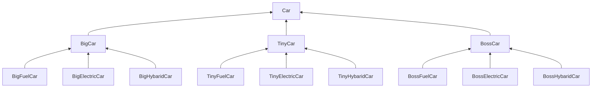

2025-03-30 16:56
Status: #idea
Tags: [[计算机基础]]


# 1 介绍
设计模式，即Design Patterns，是指在软件设计中，被反复使用的一种代码设计经验。使用设计模式的目的是为了可重用代码，提高代码的可扩展性和可维护性。
设计模式这个术语是上个世纪90年代由Erich Gamma、Richard Helm、Raplh Johnson和Jonhn Vlissides四个人总结提炼出来的，并且写了一本[Design Patterns](https://en.wikipedia.org/wiki/Design_Patterns)的书。这四人也被称为四人帮（GoF）。
设计模式主要是基于OOP编程提炼的，它基于以下几个原则：
1. 开闭原则：由Bertrand Meyer提出的开闭原则（Open Closed Principle）是指，软件应该对扩展开放，而对修改关闭。这里的意思是在增加新功能的时候，能不改代码就尽量不要改，如果只增加代码就完成了新功能，那是最好的。
2. 里氏替换原则：里氏替换原则是Barbara Liskov提出的，这是一种面向对象的设计原则，即如果我们调用一个父类的方法可以成功，那么替换成子类调用也应该完全可以运行。

# 2 创建型模式
创建型模式关注点是如何创建对象，其核心思想是要把对象的创建和使用相分离，这样使得两者能相对独立地变换。
## 2.1 工厂方法
> 定义一个用于创建对象的接口，让子类决定实例化哪一个类。Factory Method使一个类的实例化延迟到其子类。

我们以具体的例子来说：假设我们希望实现一个解析字符串到`Number`的`Factory`，可以定义如下：
```Java
public interface NumberFactory {
    Number parse(String s);
}

public class NumberFactoryImpl implements NumberFactory {
    public Number parse(String s) {
        return new BigDecimal(s);
    }
}

```

那么客户端如何创建`NumberFactoryImpl`呢？通常我们会在接口`Factory`中定义一个静态方法`getFactory()`来返回真正的子类：
```Java
public interface NumberFactory {
    // 创建方法:
    Number parse(String s);

    // 获取工厂实例:
    static NumberFactory getFactory() {
        return impl;
    }

    static NumberFactory impl = new NumberFactoryImpl();
}

NumberFactory factory = NumberFactory.getFactory();
Number result = factory.parse("123.456");
```
调用方可以完全忽略真正的工厂`NumberFactoryImpl`和实际的产品`BigDecimal`，这样做的好处是允许创建产品的代码独立地变换，而不会影响到调用方。

有的童鞋会问：一个简单的`parse()`需要写这么复杂的工厂吗？实际上大多数情况下我们并不需要抽象工厂，而是通过静态方法直接返回产品，即：
```Java
public class NumberFactory {
    public static Number parse(String s) {
        return new BigDecimal(s);
    }
}
```
这种简化的使用静态方法创建产品的方式称为静态工厂方法（Static Factory Method）。静态工厂方法广泛地应用在Java标准库中。例如：
```Java
Integer n = Integer.valueOf(100);
```
`valueOf()`内部可能会使用`new`创建一个新的`Integer`实例，但也可能直接返回一个缓存的`Integer`实例。对于调用方来说，没必要知道`Integer`创建的细节。
> [!info] 要点
> 工厂方法可以隐藏创建产品的细节，且不一定每次都会真正创建产品，完全可以返回缓存的产品，从而提升速度并减少内存消耗。

我们经常使用的另一个静态工厂方法是`List.of()`：
```Java
List<String> list = List.of("A", "B", "C");
```
这个静态工厂方法接收可变参数，然后返回`List`接口。需要注意的是，调用方获取的产品总是`List`接口，而且并不关心它的实际类型。即使调用方知道`List`产品的实际类型是`java.util.ImmutableCollections$ListN`，也不要去强制转型为子类，因为静态工厂方法`List.of()`保证返回`List`，但也完全可以修改为返回`java.util.ArrayList`。这就是里氏替换原则：返回实现接口的任意子类都可以满足该方法的要求，且不影响调用方。
> [!info] 要点
> 总是引用接口而非实现类，能允许变换子类而不影响调用方，即尽可能面向抽象编程。

## 2.2 抽象工厂
> 提供一个创建一系列相关或相互依赖对象的接口，而无需指定它们具体的类。

抽象工厂模式和工厂方法不太一样，它要解决的问题比较复杂，不但工厂是抽象的，产品是抽象的，而且有多个产品需要创建，因此，这个抽象工厂会对应到多个实际工厂，每个实际工厂负责创建多个实际产品。

假设我们希望为用户提供一个Markdown文本转换为HTML和Word的服务，它的接口定义如下：
```Java
public interface AbstractFactory {
    // 创建Html文档:
    HtmlDocument createHtml(String md);
    // 创建Word文档:
    WordDocument createWord(String md);
}

// Html文档接口:
public interface HtmlDocument {
    String toHtml();
    void save(Path path) throws IOException;
}

// Word文档接口:
public interface WordDocument {
    void save(Path path) throws IOException;
}
```

现在市场上有两家供应商：FastDoc Soft的产品便宜，并且转换速度快，而GoodDoc Soft的产品贵，但转换效果好。
```Java
public class FastHtmlDocument implements HtmlDocument {
    public String toHtml() {
        ...
    }
    public void save(Path path) throws IOException {
        ...
    }
}

public class FastWordDocument implements WordDocument {
    public void save(Path path) throws IOException {
        ...
    }
}

public class FastFactory implements AbstractFactory {
    public HtmlDocument createHtml(String md) {
        return new FastHtmlDocument(md);
    }
    public WordDocument createWord(String md) {
        return new FastWordDocument(md);
    }
}


// 实际工厂:
public class GoodFactory implements AbstractFactory {
    public HtmlDocument createHtml(String md) {
        return new GoodHtmlDocument(md);
    }
    public WordDocument createWord(String md) {
        return new GoodWordDocument(md);
    }
}

// 实际产品:
public class GoodHtmlDocument implements HtmlDocument {
    ...
}

public class GoodWordDocument implements HtmlDocument {
    ...
}
```
客户端编写代码如下：
```Java
// 创建AbstractFactory，实际类型是FastFactory:
AbstractFactory factory = new FastFactory();
// 生成Html文档:
HtmlDocument html = factory.createHtml("#Hello\nHello, world!");
html.save(Paths.get(".", "fast.html"));
// 生成Word文档:
WordDocument word = factory.createWord("#Hello\nHello, world!");
word.save(Paths.get(".", "fast.doc"));
```
客户端要使用GoodDoc Soft的服务，只需要把原来的`new FastFactory()`切换为`new GoodFactory()`即可。

注意到客户端代码除了通过`new`创建了`FastFactory`或`GoodFactory`外，其余代码只引用了产品接口，并未引用任何实际产品（例如，`FastHtmlDocument`），如果把创建工厂的代码放到`AbstractFactory`中，就可以连实际工厂也屏蔽了：
```Java
public interface AbstractFactory {
    public static AbstractFactory createFactory(String name) {
        if (name.equalsIgnoreCase("fast")) {
            return new FastFactory();
        } else if (name.equalsIgnoreCase("good")) {
            return new GoodFactory();
        } else {
            throw new IllegalArgumentException("Invalid factory name");
        }
    }
}
```

## 2.3 生成器
> 将一个复杂对象的构建与它的表示分离，使得同样的构建过程可以创建不同的表示。

生成器模式（Builder）是使用多个“小型”工厂来最终创建出一个完整对象。
当我们使用Builder的时候，一般来说，是因为创建这个对象的步骤比较多，每个步骤都需要一个零部件，最终组合成一个完整的对象。

例如由于我们经常需要构造URL字符串，可以使用Builder模式编写一个URLBuilder，调用方式如下：
```Java
String url = URLBuilder.builder() // 创建Builder
        .setDomain("www.liaoxuefeng.com") // 设置domain
        .setScheme("https") // 设置scheme
        .setPath("/") // 设置路径
        .setQuery(Map.of("a", "123", "q", "K&R")) // 设置query
        .build(); // 完成build
```
以链式调用的方式来创建对象，简化Builder模式。

## 2.4 原型
> 用原型实例指定创建对象的种类，并且通过拷贝这些原型创建新的对象。

使用原型模式更好的方式是定义一个`copy()`方法，返回明确的类型：
```Java
public class Student {
    private int id;
    private String name;
    private int score;

    public Student copy() {
        Student std = new Student();
        std.id = this.id;
        std.name = this.name;
        std.score = this.score;
        return std;
    }
}
```
原型模式应用不是很广泛，因为很多实例会持有类似文件、Socket这样的资源，而这些资源是无法复制给另一个对象共享的，只有存储简单类型的“值”对象可以复制。

## 2.5 单例
> 保证一个类仅有一个实例，并提供一个访问它的全局访问点。

```Java
public class Singleton {
    // 静态字段引用唯一实例:
    private static final Singleton INSTANCE = new Singleton();

    // 通过静态方法返回实例:
    public static Singleton getInstance() {
        return INSTANCE;
    }

    // private构造方法保证外部无法实例化:
    private Singleton() {
    }
}

// 或者直接把static变量暴露给外部：
public class Singleton {
    // 静态字段引用唯一实例:
    public static final Singleton INSTANCE = new Singleton();

    // private构造方法保证外部无法实例化:
    private Singleton() {
    }
}
```

有些童鞋可能听说过延迟加载，即在调用方第一次调用`getInstance()`时才初始化全局唯一实例，类似这样：
```Java
public class Singleton {
    private static Singleton INSTANCE = null;

    public static Singleton getInstance() {
        if (INSTANCE == null) {
            INSTANCE = new Singleton();
        }
        return INSTANCE;
    }

    private Singleton() {
    }
}
```
这种写法在多线程中是错误的，在竞争条件下会创建出多个实例。如果加锁会严重影响并发性能。

Java中可以通过静态内部类，利用了类加载机制来保证只创建一个`instance`实例。 而且由于类加载机制，不会出现多线程并发的问题。只要应用中不使用内部类，`JVM`就不会去加载这个单例类，也就不会创建单例对象。 这种方式可以同时保证延迟加载和线程安全。
```Java
public class Singleton{
    private static class SingletonHolder{
        public static Singleton instance = new Singleton();
    }

    private Singleton() {}

    public static Singleton newInstance(){
        return SingletonHolder.instance;
    }
}
```

# 3 结构型模式
结构型模式主要涉及如何组合各种对象以便获得更好、更灵活的结构。虽然面向对象的继承机制提供了最基本的子类扩展父类的功能，但结构型模式不仅仅简单地使用继承，而更多地通过组合与运行期的动态组合来实现更灵活的功能。

## 3.1 桥接
> 将抽象部分与它的实现部分分离，使它们都可以独立地变化。

假设某个汽车厂商生产三种品牌的汽车：Big、Tiny和Boss，每种品牌又可以选择燃油、纯电和混合动力。如果用传统的继承来表示各个最终车型，一共有3个抽象类加9个最终子类：

如果要新增一个品牌，或者加一个新的引擎（比如核动力），那么子类的数量增长更快。

在桥接模式中，首先把`Car`按品牌进行子类化，但是，每个品牌选择什么发动机，不再使用子类扩充，而是通过一个抽象的“修正”类，以组合的形式引入。我们来看看具体的实现。
```Java
public abstract class Car {
    public abstract void drive();
}

public interface Engine {
    void start();
}

// “修正”的抽象类
public abstract class RefinedCar extends Car {
    // 引用Engine:
    protected Engine engine;

    public RefinedCar(Engine engine) {
        this.engine = engine;
    }

    public void drive() {
        this.engine.start();
        System.out.println("Drive " + getBrand() + " car...");
    }

    public abstract String getBrand();
}

// 最终的不同品牌继承自`RefinedCar`，例如`BossCar`
public class BossCar extends RefinedCar {
    public BossCar(Engine engine) {
        super(engine);
    }

    public String getBrand() {
        return "Boss";
    }
}

// 而针对每一种引擎，继承自`Engine`，例如`HybridEngine`：
public class HybridEngine implements Engine {
    public void start() {
        System.out.println("Start Hybrid Engine...");
    }
}

// 客户端通过自己选择一个品牌，再配合一种引擎，得到最终的Car：
RefinedCar car = new BossCar(new HybridEngine());
car.drive();
```
任何`RefinedCar`的子类都可以和任何一种`Engine`自由组合，即一辆汽车的两个维度：品牌和引擎都可以独立地变化。
桥接模式实现比较复杂，实际应用也非常少，但它提供的设计思想值得借鉴，即不要过度使用继承，而是优先拆分某些部件，使用组合的方式来扩展功能。

## 3.2 装饰器
> 动态地给一个对象添加一些额外的职责。就增加功能来说，相比生成子类更为灵活。

Decorator模式的目的就是把一个一个的附加功能，用Decorator的方式给一层一层地累加到原始数据源上，最终，通过组合获得我们想要的功能。
例如：给`FileInputStream`增加缓冲和解压缩功能，用Decorator模式写出来如下：
```Java
// 创建原始的数据源:
InputStream fis = new FileInputStream("test.gz");
// 增加缓冲功能:
InputStream bis = new BufferedInputStream(fis);
// 增加解压缩功能:
InputStream gis = new GZIPInputStream(bis);
```

我们用图把Decorator模式画出来如下：
![[Pasted image 20250330204638.png]]
它实际上把核心功能和附加功能给分开了。核心功能指`FileInputStream`这些真正读数据的源头，附加功能指加缓冲、压缩、解密这些功能。如果我们要新增核心功能，就增加Component的子类，例如`ByteInputStream`。如果我们要增加附加功能，就增加Decorator的子类，例如`CipherInputStream`。两部分都可以独立地扩展，而具体如何附加功能，由调用方自由组合，从而极大地增强了灵活性。

## 3.3 适配器
> 将一个类的接口转换成客户希望的另外一个接口，使得原本由于接口不兼容而不能一起工作的那些类可以一起工作。

我们已经有一个`Task`类，实现了`Callable`接口：
```Java
public class Task implements Callable<Long> {
    private long num;
    public Task(long num) {
        this.num = num;
    }

    public Long call() throws Exception {
        long r = 0;
        for (long n = 1; n <= this.num; n++) {
            r = r + n;
        }
        System.out.println("Result: " + r);
        return r;
    }
}
```
现在，我们想通过一个线程去执行它：
```Java
Callable<Long> callable = new Task(123450000L);
Thread thread = new Thread(callable); // compile error!
thread.start();
```
发现编译不过！因为`Thread`接收`Runnable`接口，但不接收`Callable`接口。

用一个Adapter，把这个`Callable`接口“变成”`Runnable`接口，这样，就可以正常编译：
```Java
public class RunnableAdapter implements Runnable {
    // 引用待转换接口:
    private Callable<?> callable;

    public RunnableAdapter(Callable<?> callable) {
        this.callable = callable;
    }

    // 实现指定接口:
    public void run() {
        // 将指定接口调用委托给转换接口调用:
        try {
            callable.call();
        } catch (Exception e) {
            throw new RuntimeException(e);
        }
    }
}

Callable<Long> callable = new Task(123450000L);
Thread thread = new Thread(new RunnableAdapter(callable));
thread.start();
```

## 3.4 代理
> 为其他对象提供一种代理以控制对这个对象的访问。

### 3.4.1 介绍
代理模式，即Proxy，它和Adapter模式很类似。我们先回顾Adapter模式，它用于把A接口转换为B接口：
```Java
public class BAdapter implements B {
    private A a;
    public BAdapter(A a) {
        this.a = a;
    }
    public void b() {
        a.a();
    }
}
```
而Proxy模式不是把A接口转换成B接口，它还是转换成A接口：
```Java
public class AProxy implements A {
    private A a;
    public AProxy(A a) {
        this.a = a;
    }
	public void a() {
	    if (getCurrentUser().isRoot()) {
	        this.a.a();
	    } else {
	        throw new SecurityException("Forbidden");
	    }
	}
}
```
有的童鞋会问，为啥不把权限检查的功能直接写到目标实例A的内部？因为我们编写代码的原则有：
- 职责清晰：一个类只负责一件事；
- 易于测试：一次只测一个功能。

有的童鞋会发现Proxy模式和Decorator模式有些类似。确实，这两者看起来很像，但区别在于：Decorator模式让调用者自己创建核心类，然后组合各种功能，而Proxy模式决不能让调用者自己创建再组合，否则就失去了代理的功能。Proxy模式让调用者认为获取到的是核心类接口，但实际上是代理类。

### 3.4.2 例子：实现JDBC连接池
我们来看一下如何应用代理模式编写一个JDBC连接池（`DataSource`）。我们首先来编写一个虚代理，即如果调用者获取到`Connection`后，并没有执行任何SQL操作，那么这个Connection Proxy实际上并不会真正打开JDBC连接。调用者代码如下：
```Java
DataSource lazyDataSource = new LazyDataSource(jdbcUrl, jdbcUsername, jdbcPassword);
System.out.println("get lazy connection...");
try (Connection conn1 = lazyDataSource.getConnection()) {
    // 并没有实际打开真正的Connection
}
System.out.println("get lazy connection...");
try (Connection conn2 = lazyDataSource.getConnection()) {
    try (PreparedStatement ps = conn2.prepareStatement("SELECT * FROM students")) { // 打开了真正的Connection
        try (ResultSet rs = ps.executeQuery()) {
            while (rs.next()) {
                System.out.println(rs.getString("name"));
            }
        }
    }
}
```

现在我们来思考如何实现这个`LazyConnectionProxy`。为了简化代码，我们首先针对`Connection`接口做一个抽象的代理类：
```Java
public abstract class AbstractConnectionProxy implements Connection {

    // 抽象方法获取实际的Connection:
    protected abstract Connection getRealConnection();

    // 实现Connection接口的每一个方法:
    public Statement createStatement() throws SQLException {
        // 只有真正用到时才会创建连接
        return getRealConnection().createStatement();
    }

    public PreparedStatement prepareStatement(String sql) throws SQLException {
        return getRealConnection().prepareStatement(sql);
    }

    ...其他代理方法...
}
```
这个`AbstractConnectionProxy`代理类的作用是把`Connection`接口定义的方法全部实现一遍，因为`Connection`接口定义的方法太多了，后面我们要编写的`LazyConnectionProxy`只需要继承`AbstractConnectionProxy`，就不必再把`Connection`接口方法挨个实现一遍。
```Java
public class LazyConnectionProxy extends AbstractConnectionProxy {
    private Supplier<Connection> supplier;
    private Connection target = null;

    public LazyConnectionProxy(Supplier<Connection> supplier) {
        this.supplier = supplier;
    }

    // 覆写close方法：只有target不为null时才需要关闭:
    public void close() throws SQLException {
        if (target != null) {
            System.out.println("Close connection: " + target);
            super.close();
        }
    }

    @Override
    protected Connection getRealConnection() {
        if (target == null) {
            target = supplier.get();
        }
        return target;
    }
}

public class LazyDataSource implements DataSource {
    private String url;
    private String username;
    private String password;

    public LazyDataSource(String url, String username, String password) {
        this.url = url;
        this.username = username;
        this.password = password;
    }

    public Connection getConnection(String username, String password) throws SQLException {
        return new LazyConnectionProxy(() -> {
            try {
                Connection conn = DriverManager.getConnection(url, username, password);
                System.out.println("Open connection: " + conn);
                return conn;
            } catch (SQLException e) {
                throw new RuntimeException(e);
            }
        });
    }
    ...
}
```

使用连接池的时候，我们更希望能重复使用连接。如何实现可复用`Connection`的连接池？答案仍然是使用代理模式。
```Java
public class PooledConnectionProxy extends AbstractConnectionProxy {
    // 实际的Connection:
    Connection target;
    // 空闲队列:
    Queue<PooledConnectionProxy> idleQueue;

    public PooledConnectionProxy(Queue<PooledConnectionProxy> idleQueue, Connection target) {
        this.idleQueue = idleQueue;
        this.target = target;
    }

    public void close() throws SQLException {
        System.out.println("Fake close and released to idle queue for future reuse: " + target);
        // 并没有调用实际Connection的close()方法,
        // 而是把自己放入空闲队列:
        idleQueue.offer(this);
    }

    protected Connection getRealConnection() {
        return target;
    }
}

// 空闲队列由`PooledDataSource`负责维护：
public class PooledDataSource implements DataSource {
    private String url;
    private String username;
    private String password;

    // 维护一个空闲队列:
    private Queue<PooledConnectionProxy> idleQueue = new ArrayBlockingQueue<>(100);

    public PooledDataSource(String url, String username, String password) {
        this.url = url;
        this.username = username;
        this.password = password;
    }

    public Connection getConnection(String username, String password) throws SQLException {
        // 首先试图获取一个空闲连接:
        PooledConnectionProxy conn = idleQueue.poll();
        if (conn == null) {
            // 没有空闲连接时，打开一个新连接:
            conn = openNewConnection();
        } else {
            System.out.println("Return pooled connection: " + conn.target);
        }
        return conn;
    }

    private PooledConnectionProxy openNewConnection() throws SQLException {
        Connection conn = DriverManager.getConnection(url, username, password);
        System.out.println("Open new connection: " + conn);
        return new PooledConnectionProxy(idleQueue, conn);
    }
    ...
}
```

## 3.5 外观
> 为子系统中的一组接口提供一个一致的界面。Facade模式定义了一个高层接口，这个接口使得这一子系统更加容易使用。

如果客户端要跟许多子系统打交道，那么客户端需要了解各个子系统的接口，比较麻烦。如果有一个统一的“中介”，让客户端只跟中介打交道，中介再去跟各个子系统打交道，对客户端来说就比较简单。所以Facade就相当于搞了一个中介。

我们以注册公司为例，假设注册公司需要三步：
1. 向工商局申请公司营业执照；
2. 在银行开设账户；
3. 在税务局开设纳税号。
以下是三个系统的接口：
```Java
// 工商注册:
public class AdminOfIndustry {
    public Company register(String name) {
        ...
    }
}

// 银行开户:
public class Bank {
    public String openAccount(String companyId) {
        ...
    }
}

// 纳税登记:
public class Taxation {
    public String applyTaxCode(String companyId) {
        ...
    }
}
```

如果子系统比较复杂，并且客户对流程也不熟悉，那就把这些流程全部委托给中介：
```Java
public class Facade {
    public Company openCompany(String name) {
        Company c = this.admin.register(name);
        String bankAccount = this.bank.openAccount(c.getId());
        c.setBankAccount(bankAccount);
        String taxCode = this.taxation.applyTaxCode(c.getId());
        c.setTaxCode(taxCode);
        return c;
    }
}

Company c = facade.openCompany("Facade Software Ltd.");
```

很多Web程序，内部有多个子系统提供服务，经常使用一个统一的Facade入口，例如一个`RestApiController`，使得外部用户调用的时候，只关心Facade提供的接口，不用管内部到底是哪个子系统处理的。
更复杂的Web程序，会有多个Web服务，这个时候，经常会使用一个统一的网关入口来自动转发到不同的Web服务，这种提供统一入口的网关就是Gateway，它本质上也是一个Facade，但可以附加一些用户认证、限流限速的额外服务。

## 3.6 组合
> 将对象组合成树形结构以表示“部分-整体”的层次结构，使得用户对单个对象和组合对象的使用具有一致性。

组合模式（Composite）经常用于树形结构，为了简化代码，使用Composite可以把一个叶子节点与一个父节点统一起来处理。
我们来看一个具体的例子。在XML或HTML中，从根节点开始，每个节点都可能包含任意个其他节点，这些层层嵌套的节点就构成了一颗树。
要以树的结构表示XML，我们可以先抽象出节点类型`Node`：
```Java
public interface Node {
    // 添加一个节点为子节点:
    Node add(Node node);
    // 获取子节点:
    List<Node> children();
    // 输出为XML:
    String toXml();
}
```

对于一个`<abc>`这样的节点，我们称之为`ElementNode`，它可以作为容器包含多个子节点：
```Java
public class ElementNode implements Node {
    private String name;
    private List<Node> list = new ArrayList<>();

    public ElementNode(String name) {
        this.name = name;
    }

    public Node add(Node node) {
        list.add(node);
        return this;
    }

    public List<Node> children() {
        return list;
    }

    public String toXml() {
        String start = "<" + name + ">\n";
        String end = "</" + name + ">\n";
        StringJoiner sj = new StringJoiner("", start, end);
        list.forEach(node -> {
            sj.add(node.toXml() + "\n");
        });
        return sj.toString();
    }
}
```

对于普通文本，我们把它看作`TextNode`，它没有子节点：
```Java
public class TextNode implements Node {
	private String text;

	public TextNode(String text) {
		this.text = text;
	}

	public Node add(Node node) {
		throw new UnsupportedOperationException();
	}

	public List<Node> children() {
		return List.of();
	}

	public String toXml() {
		return text;
	}
}
```

此外，还可以有注释节点：
```Java
public class CommentNode implements Node {
	private String text;

	public CommentNode(String text) {
		this.text = text;
	}

	public Node add(Node node) {
		throw new UnsupportedOperationException();
	}

	public List<Node> children() {
		return List.of();
	}

	public String toXml() {
		return "<!-- " + text + " -->";
	}
}
```

通过`ElementNode`、`TextNode`和`CommentNode`，我们就可以构造出一颗树：
```Java
Node root = new ElementNode("school");
root.add(new ElementNode("classA")
        .add(new TextNode("Tom"))
        .add(new TextNode("Alice")));
root.add(new ElementNode("classB")
        .add(new TextNode("Bob"))
        .add(new TextNode("Grace"))
        .add(new CommentNode("comment...")));
System.out.println(root.toXml());
```

可见，使用Composite模式时，需要先统一单个节点以及“容器”节点的接口。作为容器节点的`ElementNode`又可以添加任意个`Node`，这样就可以构成层级结构。
类似的，像文件夹和文件、GUI窗口的各种组件，都符合Composite模式的定义，因为它们的结构天生就是层级结构。


## 3.7 享元
> 运用共享技术有效地支持大量细粒度的对象。

享元（Flyweight）的核心思想很简单：如果一个对象实例一经创建就不可变，那么反复创建相同的实例就没有必要，直接向调用方返回一个共享的实例就行，这样即节省内存，又可以减少创建对象的过程，提高运行速度。
享元模式在Java标准库中有很多应用。我们知道，包装类型如`Byte`、`Integer`都是不变类，因此，反复创建同一个值相同的包装类型是没有必要的。以`Integer`为例，如果我们通过`Integer.valueOf()`这个静态工厂方法创建`Integer`实例，当传入的`int`范围在`-128`~`+127`之间时，会直接返回缓存的`Integer`实例。
因此，享元模式就是通过工厂方法创建对象，在工厂方法内部，很可能返回缓存的实例，而不是新创建实例，从而实现不可变实例的复用。

在实际应用中，我们经常使用成熟的缓存库，例如[Guava](https://github.com/google/guava)的[Cache](https://github.com/google/guava/blob/master/guava/src/com/google/common/cache/Cache.java)，因为它提供了最大缓存数量限制、定时过期等实用功能。

# 4 行为型模式
行为型模式主要涉及算法和对象间的职责分配。通过使用对象组合，行为型模式可以描述一组对象应该如何协作来完成一个整体任务。
## 4.1 责任链
> 使多个对象都有机会处理请求，从而避免请求的发送者和接收者之间的耦合关系。将这些对象连成一条链，并沿着这条链传递该请求，直到有一个对象处理它为止。

在实际场景中，财务审批就是一个责任链模式。假设某个员工需要报销一笔费用，审核者可以分为：
- Manager：只能审核1000元以下的报销；
- Director：只能审核10000元以下的报销；
- CEO：可以审核任意额度。
用责任链模式设计此报销流程时，每个审核者只关心自己责任范围内的请求，并且处理它。对于超出自己责任范围的，扔给下一个审核者处理，这样，将来继续添加审核者的时候，不用改动现有逻辑。

我们来看看如何实现责任链模式：
```Java
// 首先，我们要抽象出请求对象，它将在责任链上传递：
public class Request {
    private String name;
    private BigDecimal amount;

    public Request(String name, BigDecimal amount) {
        this.name = name;
        this.amount = amount;
    }

    public String getName() {
        return name;
    }

    public BigDecimal getAmount() {
        return amount;
    }
}

// 其次，我们要抽象出处理器：
public interface Handler {
    // 返回Boolean.TRUE = 成功
    // 返回Boolean.FALSE = 拒绝
    // 返回null = 交下一个处理
	Boolean process(Request request);
}

// 然后，依次编写ManagerHandler、DirectorHandler和CEOHandler。以ManagerHandler为例：
public class ManagerHandler implements Handler {
    public Boolean process(Request request) {
        // 如果超过1000元，处理不了，交下一个处理:
        if (request.getAmount().compareTo(BigDecimal.valueOf(1000)) > 0) {
            return null;
        }
        // 对Bob有偏见:
        return !request.getName().equalsIgnoreCase("bob");
    }
}

// 有了不同的Handler后，我们还要把这些Handler组合起来，变成一个链，并通过一个统一入口处理：
public class HandlerChain {
    // 持有所有Handler:
    private List<Handler> handlers = new ArrayList<>();

    public void addHandler(Handler handler) {
        this.handlers.add(handler);
    }

    public boolean process(Request request) {
        // 依次调用每个Handler:
        for (Handler handler : handlers) {
            Boolean r = handler.process(request);
            if (r != null) {
                // 如果返回TRUE或FALSE，处理结束:
                System.out.println(request + " " + (r ? "Approved by " : "Denied by ") + handler.getClass().getSimpleName());
                return r;
            }
        }
        throw new RuntimeException("Could not handle request: " + request);
    }
}

// 现在，我们就可以在客户端组装出责任链，然后用责任链来处理请求：
// 构造责任链:
HandlerChain chain = new HandlerChain();
chain.addHandler(new ManagerHandler());
chain.addHandler(new DirectorHandler());
chain.addHandler(new CEOHandler());
// 处理请求:
chain.process(new Request("Bob", new BigDecimal("123.45")));
chain.process(new Request("Alice", new BigDecimal("1234.56")));
chain.process(new Request("Bill", new BigDecimal("12345.67")));
chain.process(new Request("John", new BigDecimal("123456.78")));
```
责任链模式本身很容易理解，需要注意的是，`Handler`添加的顺序很重要，如果顺序不对，处理的结果可能就不是符合要求的。

此外，责任链模式有很多变种。有些责任链的实现方式是通过某个`Handler`手动调用下一个`Handler`来传递`Request`，例如：
```Java
public class AHandler implements Handler {
    private Handler next;
    public void process(Request request) {
        if (!canProcess(request)) {
            // 手动交给下一个Handler处理:
            next.process(request);
        } else {
            ...
        }
    }
}
```

还有一些责任链模式，每个`Handler`都有机会处理`Request`，通常这种责任链被称为拦截器（Interceptor）或者过滤器（Filter），它的目的不是找到某个`Handler`处理掉`Request`，而是每个`Handler`都做一些工作，比如：
- 记录日志；
- 检查权限；
- 准备相关资源；
- ...
例如，JavaEE的Servlet规范定义的`Filter`就是一种责任链模式，它不但允许每个`Filter`都有机会处理请求，还允许每个`Filter`决定是否将请求“放行”给下一个`Filter`。

## 4.2 命令
> 将一个请求封装为一个对象，从而使你可用不同的请求对客户进行参数化，对请求排队或记录请求日志，以及支持可撤销的操作。

在使用命令模式前，我们先以一个编辑器为例子，看看如何实现简单的编辑操作：
```Java
public class TextEditor {
    private StringBuilder buffer = new StringBuilder();

    public void copy() {
        ...
    }

    public void paste() {
        String text = getFromClipBoard();
        add(text);
    }

    public void add(String s) {
        buffer.append(s);
    }

    public void delete() {
        if (buffer.length() > 0) {
            buffer.deleteCharAt(buffer.length() - 1);
        }
    }

    public String getState() {
        return buffer.toString();
    }
}

TextEditor editor = new TextEditor();
editor.add("Command pattern in text editor.\n");
editor.copy();
editor.paste();
System.out.println(editor.getState());
```
这是直接调用方法，调用方需要了解`TextEditor`的所有接口信息。

如果改用命令模式，我们就要把调用方发送命令和执行方执行命令分开。怎么分？解决方案是引入一个`Command`接口：
```Java
public interface Command {
    void execute();
}

public class CopyCommand implements Command {
    // 持有执行者对象:
    private TextEditor receiver;

    public CopyCommand(TextEditor receiver) {
        this.receiver = receiver;
    }

    public void execute() {
        receiver.copy();
    }
}

public class PasteCommand implements Command {
    private TextEditor receiver;

    public PasteCommand(TextEditor receiver) {
        this.receiver = receiver;
    }

    public void execute() {
        receiver.paste();
    }
}

TextEditor editor = new TextEditor();
editor.add("Command pattern in text editor.\n");
// 执行一个CopyCommand:
Command copy = new CopyCommand(editor);
copy.execute();
editor.add("----\n");
// 执行一个PasteCommand:
Command paste = new PasteCommand(editor);
paste.execute();
System.out.println(editor.getState());
```

有的童鞋会有疑问：搞了一大堆`Command`，多了好几个类，还不如直接写简单。实际上，使用命令模式，确实增加了系统的复杂度。如果需求很简单，那么直接调用显然更直观而且更简单。
视需求而定。如果`TextEditor`复杂到一定程度，并且需要支持Undo、Redo的功能时，就需要使用命令模式，因为我们可以给每个命令增加`undo()`：
```Java
public interface Command {
    void execute();
    void undo();
}
```
然后把执行的一系列命令用`List`保存起来，就既能支持Undo，又能支持Redo。这个时候，我们又需要一个`Invoker`对象，负责执行命令并保存历史命令：
![[Pasted image 20250330212216.png]]
命令模式的设计思想是把命令的创建和执行分离，使得调用者无需关心具体的执行过程。

## 4.3 中介
> 用一个中介对象来封装一系列的对象交互。中介者使各个对象不需要显式地相互引用，从而使其耦合松散，而且可以独立地改变它们之间的交互。

中介模式（Mediator）又称调停者模式，它的目的是把多方会谈变成双方会谈，从而实现多方的松耦合。
考虑一个简单的点餐输入：
![[Pasted image 20250330212746.png]]
这个小系统有4个参与对象：
- 多选框；
- “选择全部”按钮；
- “取消所有”按钮；
- “反选”按钮。
它的复杂性在于，当多选框变化时，它会影响“选择全部”和“取消所有”按钮的状态（是否可点击），当用户点击某个按钮时，例如“反选”，除了会影响多选框的状态，它又可能影响“选择全部”和“取消所有”按钮的状态。

所以这是一个多方会谈，逻辑写起来很复杂：
![[Pasted image 20250330212858.png]]
如果我们引入一个中介，把多方会谈变成多个双方会谈，虽然多了一个对象，但对象之间的关系就变简单了：
![[Pasted image 20250330212928.png]]

下面我们用中介模式来实现各个UI组件的交互。首先把UI组件给画出来：
```Java
public class Main {
    public static void main(String[] args) {
        new OrderFrame("Hanburger", "Nugget", "Chip", "Coffee");
    }
}

class OrderFrame extends JFrame {
    public OrderFrame(String... names) {
        setTitle("Order");
        setSize(460, 200);
        setDefaultCloseOperation(JFrame.EXIT_ON_CLOSE);
        Container c = getContentPane();
        c.setLayout(new FlowLayout(FlowLayout.LEADING, 20, 20));
        c.add(new JLabel("Use Mediator Pattern"));
        List<JCheckBox> checkboxList = addCheckBox(names);
        JButton selectAll = addButton("Select All");
        JButton selectNone = addButton("Select None");
        selectNone.setEnabled(false);
        JButton selectInverse = addButton("Inverse Select");
        new Mediator(checkBoxList, selectAll, selectNone, selectInverse);
        setVisible(true);
    }

    private List<JCheckBox> addCheckBox(String... names) {
        JPanel panel = new JPanel();
        panel.add(new JLabel("Menu:"));
        List<JCheckBox> list = new ArrayList<>();
        for (String name : names) {
            JCheckBox checkbox = new JCheckBox(name);
            list.add(checkbox);
            panel.add(checkbox);
        }
        getContentPane().add(panel);
        return list;
    }

    private JButton addButton(String label) {
        JButton button = new JButton(label);
        getContentPane().add(button);
        return button;
    }
}
```
然后，我们设计一个Mediator类，它引用4个UI组件，并负责跟它们交互：
```Java
public class Mediator {
    // 引用UI组件:
    private List<JCheckBox> checkBoxList;
    private JButton selectAll;
    private JButton selectNone;
    private JButton selectInverse;

    public Mediator(List<JCheckBox> checkBoxList, JButton selectAll, JButton selectNone, JButton selectInverse) {
        this.checkBoxList = checkBoxList;
        this.selectAll = selectAll;
        this.selectNone = selectNone;
        this.selectInverse = selectInverse;
        // 绑定事件:
        this.checkBoxList.forEach(checkBox -> {
            checkBox.addChangeListener(this::onCheckBoxChanged);
        });
        this.selectAll.addActionListener(this::onSelectAllClicked);
        this.selectNone.addActionListener(this::onSelectNoneClicked);
        this.selectInverse.addActionListener(this::onSelectInverseClicked);
    }

    // 当checkbox有变化时:
    public void onCheckBoxChanged(ChangeEvent event) {
        boolean allChecked = true;
        boolean allUnchecked = true;
        for (var checkBox : checkBoxList) {
            if (checkBox.isSelected()) {
                allUnchecked = false;
            } else {
                allChecked = false;
            }
        }
        selectAll.setEnabled(!allChecked);
        selectNone.setEnabled(!allUnchecked);
    }

    // 当点击select all:
    public void onSelectAllClicked(ActionEvent event) {
        checkBoxList.forEach(checkBox -> checkBox.setSelected(true));
        selectAll.setEnabled(false);
        selectNone.setEnabled(true);
    }

    // 当点击select none:
    public void onSelectNoneClicked(ActionEvent event) {
        checkBoxList.forEach(checkBox -> checkBox.setSelected(false));
        selectAll.setEnabled(true);
        selectNone.setEnabled(false);
    }

    // 当点击select inverse:
    public void onSelectInverseClicked(ActionEvent event) {
        checkBoxList.forEach(checkBox -> checkBox.setSelected(!checkBox.isSelected()));
        onCheckBoxChanged(null);
    }
}
```

使用Mediator模式后，我们得到了以下好处：
- 各个UI组件互不引用，这样就减少了组件之间的耦合关系；
- Mediator用于当一个组件发生状态变化时，根据当前所有组件的状态决定更新某些组件；
- 如果新增一个UI组件，我们只需要修改Mediator更新状态的逻辑，现有的其他UI组件代码不变。

Mediator模式经常用在有众多交互组件的UI上。为了简化UI程序，MVC模式以及MVVM模式都可以看作是Mediator模式的扩展。

## 4.4 观察者
> 定义对象间的一种一对多的依赖关系，当一个对象的状态发生改变时，所有依赖于它的对象都得到通知并被自动更新。

观察者模式（Observer）又称发布-订阅模式（Publish-Subscribe：Pub/Sub）。它是一种通知机制，让发送通知的一方（被观察方）和接收通知的一方（观察者）能彼此分离，互不影响。

假设一个电商网站，有多种`Product`（商品），同时，`Customer`（消费者）和`Admin`（管理员）对商品上架、价格改变都感兴趣，希望能第一时间获得通知。于是，`Store`（商场）可以这么写：
```Java
public class Store {
    Customer customer;
    Admin admin;

    private Map<String, Product> products = new HashMap<>();

    public void addNewProduct(String name, double price) {
        Product p = new Product(name, price);
        products.put(p.getName(), p);
        // 通知用户:
        customer.onPublished(p);
        // 通知管理员:
        admin.onPublished(p);
    }

    public void setProductPrice(String name, double price) {
        Product p = products.get(name);
        p.setPrice(price);
        // 通知用户:
        customer.onPriceChanged(p);
        // 通知管理员:
        admin.onPriceChanged(p);
    }
}
```
上述`Store`类最大的问题是，如果要加一个新的观察者类型，例如工商局管理员，`Store`类就必须继续改动。
因此，上述问题的本质是`Store`希望发送通知给那些关心`Product`的对象，但`Store`并不想知道这些人是谁。**观察者模式就是要分离被观察者和观察者之间的耦合关系**。

要实现这一目标也很简单，`Store`不能直接引用`Customer`和`Admin`，相反，它引用一个`ProductObserver`接口，任何人想要观察`Store`，只要实现该接口，并且把自己注册到`Store`即可：
```Java
public class Store {
    private List<ProductObserver> observers = new ArrayList<>();
    private Map<String, Product> products = new HashMap<>();

    // 注册观察者:
    public void addObserver(ProductObserver observer) {
        this.observers.add(observer);
    }

    // 取消注册:
    public void removeObserver(ProductObserver observer) {
        this.observers.remove(observer);
    }

    public void addNewProduct(String name, double price) {
        Product p = new Product(name, price);
        products.put(p.getName(), p);
        // 通知观察者:
        observers.forEach(o -> o.onPublished(p));
    }

    public void setProductPrice(String name, double price) {
        Product p = products.get(name);
        p.setPrice(price);
        // 通知观察者:
        observers.forEach(o -> o.onPriceChanged(p));
    }
}
```

观察者模式也有很多变体形式。有的观察者模式把被观察者也抽象出接口：
```Java
public interface ProductObservable { // 注意此处拼写是Observable不是Observer!
    void addObserver(ProductObserver observer);
    void removeObserver(ProductObserver observer);
}

public class Store implements ProductObservable {
    ...
}
```

有些观察者模式把通知变成一个Event对象，从而不再有多种方法通知，而是统一成一种：
```Java
public interface ProductObserver {
    void onEvent(ProductEvent event);
}
```
让观察者自己从Event对象中读取通知类型和通知数据。

有的童鞋可能发现Java标准库有个`java.util.Observable`类和一个`Observer`接口，用来帮助我们实现观察者模式。但是，这个类非常不！好！用！实现观察者模式的时候，也不推荐借助这两个东东。

## 4.5 状态
> 允许一个对象在其内部状态改变时改变它的行为。对象看起来似乎修改了它的类。

什么是状态？我们以QQ聊天为例，一个用户的QQ有几种状态：
- 离线状态（尚未登录）；
- 正在登录状态；
- 在线状态；
- 忙状态（暂时离开）。
如何表示状态？我们定义一个`enum`就可以表示不同的状态。但不同的状态需要对应不同的行为，比如收到消息时：
```Java
if (state == ONLINE) {
    // 闪烁图标
} else if (state == BUSY) {
    reply("现在忙，稍后回复");
} else if ...
```
状态模式的目的是为了把上述一大串`if...else...`的逻辑给分拆到不同的状态类中，使得将来增加状态比较容易。

例如，我们设计一个聊天机器人，它有两个状态：
- 未连线；
- 已连线。
```Java
public class DisconnectedState implements State {
    public String init() {
        return "Bye!";
    }

    public String reply(String input) {
        return "";
    }
}

public class ConnectedState implements State {
    public String init() {
        return "Hello, I'm Bob.";
    }

    public String reply(String input) {
        if (input.endsWith("?")) {
            return "Yes. " + input.substring(0, input.length() - 1) + "!";
        }
        if (input.endsWith(".")) {
            return input.substring(0, input.length() - 1) + "!";
        }
        return input.substring(0, input.length() - 1) + "?";
    }
}
```
**状态模式的关键设计思想在于状态切换**，我们引入一个`BotContext`完成状态切换：
```Java
public class BotContext {
	private State state = new DisconnectedState();

	public String chat(String input) {
		if ("hello".equalsIgnoreCase(input)) {
            // 收到hello切换到在线状态:
			state = new ConnectedState();
			return state.init();
		} else if ("bye".equalsIgnoreCase(input)) {
            /  收到bye切换到离线状态:
			state = new DisconnectedState();
			return state.init();
		}
		return state.reply(input);
	}
}
```

> [!info] 要点
> 状态模式的设计思想是把不同状态的逻辑分离到不同的状态类中，从而使得增加新状态更容易；
> 状态模式的实现关键在于状态转换。简单的状态转换可以直接由调用方指定，复杂的状态转换可以在内部根据条件触发完成。

## 4.6 策略
> 定义一系列的算法，把它们一个个封装起来，并且使它们可相互替换。本模式使得算法可独立于使用它的客户而变化。

策略模式在Java标准库中应用非常广泛，我们以排序为例，看看如何通过`Arrays.sort()`实现忽略大小写排序：
```Java
import java.util.Arrays;

public class Main {
    public static void main(String[] args) throws InterruptedException {
        String[] array = { "apple", "Pear", "Banana", "orange" };
        Arrays.sort(array, String::compareToIgnoreCase);
        System.out.println(Arrays.toString(array));
    }
}
```
如果我们想忽略大小写排序，就传入`String::compareToIgnoreCase`，如果我们想倒序排序，就传入`(s1, s2) -> -s1.compareTo(s2)`，这个比较两个元素大小的算法就是策略。
因此，上述排序使用到了策略模式，它实际上指，**在一个方法中，流程是确定的，但是，某些关键步骤的算法依赖调用方传入的策略，这样，传入不同的策略，即可获得不同的结果，大大增强了系统的灵活性**。

一个完整的策略模式要定义策略以及使用策略的上下文。我们以购物车结算为例，假设网站针对普通会员、Prime会员有不同的折扣，同时活动期间还有一个满100减20的活动，这些就可以作为策略实现：
```Java
public interface DiscountStrategy {
    // 计算折扣额度:
    BigDecimal getDiscount(BigDecimal total);
}

public class UserDiscountStrategy implements DiscountStrategy {
    public BigDecimal getDiscount(BigDecimal total) {
        // 普通会员打九折:
        return total.multiply(new BigDecimal("0.1")).setScale(2, RoundingMode.DOWN);
    }
}

public class OverDiscountStrategy implements DiscountStrategy {
    public BigDecimal getDiscount(BigDecimal total) {
        // 满100减20优惠:
        return total.compareTo(BigDecimal.valueOf(100)) >= 0 ? BigDecimal.valueOf(20) : BigDecimal.ZERO;
    }
}
```
最后，要应用策略，我们需要一个`DiscountContext`：
```Java
public class DiscountContext {
    // 持有某个策略:
    private DiscountStrategy strategy = new UserDiscountStrategy();

    // 允许客户端设置新策略:
    public void setStrategy(DiscountStrategy strategy) {
        this.strategy = strategy;
    }

    public BigDecimal calculatePrice(BigDecimal total) {
        return total.subtract(this.strategy.getDiscount(total)).setScale(2);
    }
}


DiscountContext ctx = new DiscountContext();

// 默认使用普通会员折扣:
BigDecimal pay1 = ctx.calculatePrice(BigDecimal.valueOf(105));
System.out.println(pay1);

// 使用满减折扣:
ctx.setStrategy(new OverDiscountStrategy());
BigDecimal pay2 = ctx.calculatePrice(BigDecimal.valueOf(105));
System.out.println(pay2);

// 使用Prime会员折扣:
ctx.setStrategy(new PrimeDiscountStrategy());
BigDecimal pay3 = ctx.calculatePrice(BigDecimal.valueOf(105));
System.out.println(pay3);
```

## 4.7 模板方法
> 定义一个操作中的算法的骨架，而将一些步骤延迟到子类中，使得子类可以不改变一个算法的结构即可重定义该算法的某些特定步骤。

模板方法（Template Method）是一个比较简单的模式。它的主要思想是，定义一个操作的一系列步骤，对于某些暂时确定不下来的步骤，就留给子类去实现好了，这样不同的子类就可以定义出不同的步骤。

假设我们开发了一个从数据库读取设置的类：
```Java
public class Setting {
    public final String getSetting(String key) {
        String value = readFromDatabase(key);
        return value;
    }

	private String readFromDatabase(String key) {
        // TODO: 从数据库读取
    }
}
```
由于从数据库读取数据较慢，我们可以考虑把读取的设置缓存起来，这样下一次读取同样的key就不必再访问数据库了。但是怎么实现缓存，暂时没想好，但不妨碍我们先写出使用缓存的代码：
```Java
public abstract class AbstractSetting {
    public final String getSetting(String key) {
        // 先从缓存读取:
        String value = lookupCache(key);
        if (value == null) {
            // 在缓存中未找到,从数据库读取:
            value = readFromDatabase(key);
            System.out.println("[DEBUG] load from db: " + key + " = " + value);
            // 放入缓存:
            putIntoCache(key, value);
        } else {
            System.out.println("[DEBUG] load from cache: " + key + " = " + value);
        }
        return value;
    }
    
	protected abstract String lookupCache(String key);

	protected abstract void putIntoCache(String key, String value);
}
```

假设我们希望用一个`Map`做缓存，那么可以写一个`LocalSetting`：
```Java
public class LocalSetting extends AbstractSetting {
    private Map<String, String> cache = new HashMap<>();

    protected String lookupCache(String key) {
        return cache.get(key);
    }

    protected void putIntoCache(String key, String value) {
        cache.put(key, value);
    }
}
```
如果我们要使用Redis做缓存，那么可以再写一个`RedisSetting`：
```Java
public class RedisSetting extends AbstractSetting {
    private RedisClient client = RedisClient.create("redis://localhost:6379");

    protected String lookupCache(String key) {
        try (StatefulRedisConnection<String, String> connection = client.connect()) {
            RedisCommands<String, String> commands = connection.sync();
            return commands.get(key);
        }
    }

    protected void putIntoCache(String key, String value) {
        try (StatefulRedisConnection<String, String> connection = client.connect()) {
            RedisCommands<String, String> commands = connection.sync();
            commands.set(key, value);
        }
    }
}
```

可见，模板方法的核心思想是：父类定义骨架，子类实现某些细节。
为了防止子类重写父类的骨架方法，可以在父类中对骨架方法使用`final`。对于需要子类实现的抽象方法，一般声明为`protected`，使得这些方法对外部客户端不可见。

## 4.8 访问者
> 表示一个作用于某对象结构中的各元素的操作。它使你可以在不改变各元素的类的前提下定义作用于这些元素的新操作。

访问者模式的设计比较复杂，如果我们查看GoF原始的访问者模式，它是这么设计的：
![[Pasted image 20250330215409.png]]
上述模式的复杂之处在于上述访问者模式为了实现所谓的“双重分派”，设计了一个回调再回调的机制。因为Java只支持基于多态的单分派模式，这里强行模拟出“双重分派”反而加大了代码的复杂性。

这里我们只介绍简化的访问者模式。假设我们要递归遍历某个文件夹的所有子文件夹和文件，然后找出`.java`文件，正常的做法是写个递归：
```Java
void scan(File dir, List<File> collector) {
    for (File file : dir.listFiles()) {
        if (file.isFile() && file.getName().endsWith(".java")) {
            collector.add(file);
        } else if (file.isDir()) {
            // 递归调用:
            scan(file, collector);
        }
    }
}
```
上述代码的问题在于，扫描目录的逻辑和处理.java文件的逻辑混在了一起。如果下次需要增加一个清理`.class`文件的功能，就必须再重复写扫描逻辑。

因此，访问者模式先把数据结构（这里是文件夹和文件构成的树型结构）和对其的操作（查找文件）分离开，以后如果要新增操作（例如清理`.class`文件），只需要新增访问者，不需要改变现有逻辑。
首先，我们需要定义访问者接口，即该访问者能够干的事情：
```Java
public interface Visitor {
    // 访问文件夹:
    void visitDir(File dir);
    // 访问文件:
    void visitFile(File file);
}
```
紧接着，我们要定义能持有文件夹和文件的数据结构`FileStructure`：
```Java
public class FileStructure {
    // 根目录:
    private File path;
    public FileStructure(File path) {
        this.path = path;
    }

    public void handle(Visitor visitor) {
		scan(this.path, visitor);
	}

	private void scan(File file, Visitor visitor) {
		if (file.isDirectory()) {
            // 让访问者处理文件夹:
			visitor.visitDir(file);
			for (File sub : file.listFiles()) {
                // 递归处理子文件夹:
				scan(sub, visitor);
			}
		} else if (file.isFile()) {
            // 让访问者处理文件:
			visitor.visitFile(file);
		}
	}
}
```
这样，我们就把访问者的行为抽象出来了。如果我们要实现一种操作，例如，查找`.java`文件，就传入`JavaFileVisitor`：
```Java
public class JavaFileVisitor implements Visitor {
    public void visitDir(File dir) {
        System.out.println("Visit dir: " + dir);
    }

    public void visitFile(File file) {
        if (file.getName().endsWith(".java")) {
            System.out.println("Found java file: " + file);
        }
    }
}

FileStructure fs = new FileStructure(new File("."));
fs.handle(new JavaFileVisitor());
```

可见，访问者模式的核心思想是为了访问比较复杂的数据结构，不去改变数据结构，而是把对数据的操作抽象出来，在“访问”的过程中以回调形式在访问者中处理操作逻辑。如果要新增一组操作，那么只需要增加一个新的访问者。

## 4.9 备忘录
> 在不破坏封装性的前提下，捕获一个对象的内部状态，并在该对象之外保存这个状态。

其实我们使用的几乎所有软件都用到了备忘录模式。最简单的备忘录模式就是保存到文件，打开文件。对于文本编辑器来说，保存就是把`TextEditor`类的字符串存储到文件，打开就是恢复`TextEditor`类的状态。对于图像编辑器来说，原理是一样的，只是保存和恢复的数据格式比较复杂而已。Java的序列化也可以看作是备忘录模式。
在使用文本编辑器的时候，我们还经常使用Undo、Redo这些功能。这些其实也可以用备忘录模式实现，即不定期地把`TextEditor`类的字符串复制一份存起来，这样就可以Undo或Redo。

标准的备忘录模式有这么几种角色：
- Memento：存储的内部状态；
- Originator：创建一个备忘录并设置其状态；
- Caretaker：负责保存备忘录。
实际上我们在使用备忘录模式的时候，不必设计得这么复杂，只需要对类似`TextEditor`的类，增加`getState()`和`setState()`就可以了。

## 4.10 解释器
> 给定一个语言，定义它的文法的一种表示，并定义一个解释器，这个解释器使用该表示来解释语言中的句子。

解释器模式（Interpreter）是一种针对特定问题设计的一种解决方案。例如，匹配字符串的时候，由于匹配条件非常灵活，使得通过代码来实现非常不灵活。举个例子，针对以下的匹配条件：
- 以`+`开头的数字表示的区号和电话号码，如`+861012345678`；
- 以英文开头，后接英文和数字，并以.分隔的域名，如`www.liaoxuefeng.com`；
- 以`/`开头的文件路径，如`/path/to/file.txt`；
- ...

因此，需要一种通用的表示方法——正则表达式来进行匹配。正则表达式就是一个字符串，但要把正则表达式解析为语法树，然后再匹配指定的字符串，就需要一个解释器。
实现一个完整的正则表达式的解释器非常复杂，但是使用解释器模式却很简单：
```Java
String s = "+861012345678";
System.out.println(s.matches("^\\+\\d+$"));
```

解释器模式通过抽象语法树实现对用户输入的解释执行。
解释器模式的实现通常非常复杂，且一般只能解决一类特定问题。

## 4.11 迭代器
> 提供一种方法顺序访问一个聚合对象中的各个元素，而又不需要暴露该对象的内部表示。

迭代器模式（Iterator）实际上在Java的集合类中已经广泛使用了。我们以`List`为例，要遍历`ArrayList`，即使我们知道它的内部存储了一个`Object[]`数组，也不应该直接使用数组索引去遍历，因为这样需要了解集合内部的存储结构。如果使用`Iterator`遍历，那么，`ArrayList`和`LinkedList`都可以以一种统一的接口来遍历。

---
# 5 引用